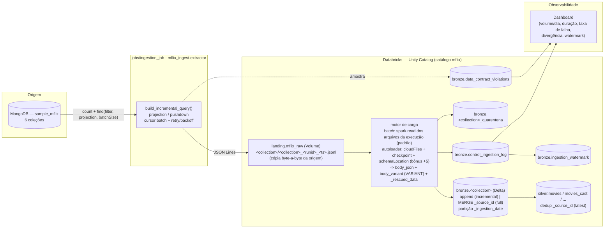

# Arquitetura — Ingestão `sample_mflix` → Bronze

Solução real implementada neste repositório. Origem MongoDB → Landing (Volume) →
carga (motor `batch` padrão, ou `autoloader`) → Bronze (Delta) → controle/observabilidade.

---

## 1. Diagrama



---

## 2. Camadas e nomenclatura (R6)

Padrão de catálogo: **`<catalog>.<schema>.<objeto>`**, `catalog = mflix` (parametrizável
via widget `catalog` / override).

| Camada | Objeto | Descrição |
|---|---|---|
| Landing | `mflix.landing.mflix_raw` (Volume) | `.../<collection>/<collection>_<run_id>_<ts>.jsonl` — 1 arquivo por coleção por execução. Dado **como veio da origem**. |
| Landing (operacional) | `.../_checkpoints/<collection>` | checkpoint (só motor `autoloader`) — exactly-once por arquivo |
| Landing (operacional) | `.../_schemas/<collection>` | schemaLocation persistido (só motor `autoloader`) |
| Bronze | `mflix.bronze.<collection>` | Delta, append-only (incremental) / MERGE (full), particionada por `_ingestion_date` |
| Bronze | `mflix.bronze.<collection>_quarentena` | registros sem `_source_id` ou JSON inválido (R7) |
| Bronze | `mflix.bronze.control_ingestion_log` | R5 — 1 linha por execução por coleção |
| Bronze | `mflix.bronze.ingestion_watermark` | watermark persistida por coleção (R3) |
| Bronze | `mflix.bronze.data_contract_violations` | violações do data contract (bônus) |
| Silver | `mflix.silver.movies`, `movies_cast`, `movies_genres`, ... | dedup + normalização (bônus +4) |

### Colunas de rastreabilidade da Bronze (R4)

| Coluna | Origem do valor |
|---|---|
| `_source_id` | `_id` do documento (chave de negócio, nunca nula) |
| `body_variant` | documento inteiro como `VARIANT` (queryável) |
| `body_json` | documento re-serializado (JSON canônico, lossless) |
| `_rescued_data` | campos fora do schema no modo `inferred` (R7) — nunca descartados |
| `_source_hash` | `sha256(body_json)` — auditoria / dedup |
| `_source_file` | arquivo da landing de onde veio a linha |
| `_ingestion_id` | UUID da execução (run id) |
| `_ingestion_timestamp` | timestamp UTC da gravação |
| `_source_path` | `mongodb_atlas` (tag configurável) |
| `_load_type` | `full` \| `incremental` |
| `_ingestion_date` | data UTC — **coluna de partição** |

---

## 3. Decisões técnicas

**Formato dos arquivos na landing**
```
Decisão: JSON Lines (um documento JSON por linha), sem compressão, 1 arquivo por
         coleção por execução.
Justificativa: JSONL é splittable e lido 1 linha = 1 documento (sem multiLine).
         Preserva o documento exatamente como veio da origem (serialização
         json.dumps + encoder BSON). O arquivo imutável no Volume é a evidência
         de fidelidade à origem (R6).
```

**Motor de carga landing → Bronze**
```
Decisão: motor `batch` (spark.read dos arquivos DA execução) como padrão;
         motor `autoloader` (readStream cloudFiles + checkpoint + schemaLocation
         + Trigger.AvailableNow) disponível via config, usado no bronze_job.
Justificativa: o volume total (~80k linhas) não justifica o custo de cold start
         de 6 streams em série (observado ~20 min / travamento em Serverless).
         O `batch` lê só o `.jsonl` da execução (run_id no nome), roda em ~1-2 min,
         e preserva body_json byte-a-byte. Idempotência: watermark (incremental)
         + MERGE por _source_id (full), sem depender de checkpoint.
         O `autoloader` fica para reprocessamento da landing e para atender
         literalmente o bônus +5 — fora do caminho crítico.
```

**Estratégia de idempotência na Bronze (R3)**
```
Decisão:
  - coleções incrementais (comments, movies): APPEND. Não-duplicação vem de
    (a) watermark persistida + filtro $gt no extract e (b) o motor `batch` ler
    somente o arquivo `.jsonl` daquela execução (`<run_id>` no nome) — ou o
    checkpoint, no motor `autoloader`.
  - coleções full (users, theaters, sessions, embedded_movies): MERGE por _source_id
    (upsert) — rodar de novo não cria linha nova.
  - modo reprocesso (bronze_job lê a landing inteira): sempre MERGE.
Justificativa: append preserva histórico de chegada nas incrementais (Bronze =
         verdade append-only); MERGE resolve o caso "recarrega tudo" das full sem
         inflar a tabela. Ambos os caminhos são idempotentes a re-execução.
Risco residual documentado: se o extract grava o arquivo e falha ANTES de
         persistir a watermark, a próxima execução re-extrai a janela; o novo
         arquivo é ingerido (append) e a reconciliação marca PARTIAL por
         duplicidade de _source_id. A watermark NÃO avança em PARTIAL por
         shortfall; consumo a jusante (Silver) deduplica por _source_id/latest.
```

**Tratamento de schema drift (R7)**
```
Decisão: modo padrão single_variant — body_json (linha crua) + body_variant
         (VARIANT). Schema drift é estruturalmente impossível (VARIANT acomoda
         qualquer forma). Modo alternativo inferred: leitura com schema inferido +
         coluna de rescue (`columnNameOfCorruptRecord`/`rescuedDataColumn`) —
         campo divergente/registro malformado vai para _rescued_data, nunca quebra.
Justificativa: NoSQL schemaless — travar um StructType na Bronze geraria
         reprocessamento a cada campo novo. VARIANT + _rescued_data preserva
         100% do documento e empurra a tipagem para a Silver.
Registros irrecuperáveis: linha sem _id ou JSON inválido -> tabela
         <collection>_quarentena (contada em qtd_quarentena no control log),
         nunca descartada em silêncio.
Impacto na Silver: a Silver lê body_variant com try_cast por campo; campos
         em _rescued_data podem ser promovidos explicitamente quando
         estabilizarem.
```

**Modos de carga por coleção**

| Coleção | Modo | Watermark field | Justificativa |
|---|---|---|---|
| `movies` | incremental | `lastupdated` (string) | ~21k docs; string `YYYY-MM-DD HH:MM:SS.nnnnnnnnn` de largura fixa → `$gt` lexicográfico. `fullplot`/`poster` fora da projection. Docs sem `lastupdated` só entram na 1ª carga. |
| `comments` | incremental | `date` (ISODate) | maior volume (~50k); `date` é ISODate nativo → incremental confiável. Coleção das 3 evidências. |
| `users` | full | — | dimensão ~185; `password` fora da projection. MERGE por `_source_id`. |
| `theaters` | full | — | ~1.5k; GeoJSON aninhado preservado no VARIANT. |
| `sessions` | full | — | pode estar vazia → `allow_empty=true` (log SUCCESS, `qtd_lida_origem=0`). `jwt` fora da projection. |
| `embedded_movies` | full | — | ~3.5k; `plot_embedding` (~12KB/doc) **obrigatoriamente** fora da projection (R2/memória). |

---

## 4. Reconciliação (R8) — limiares

`divergencia_pct = |qtd_lida_origem − qtd_gravada_destino| / qtd_lida_origem × 100`

| Condição | Status | Watermark avança? |
|---|---|---|
| divergência ≤ `threshold_pct` (default 1%, `comments` 0.5%), sem dup, contrato ok | `SUCCESS` | sim |
| divergência > limiar **por excesso** (over-ingestão) ou duplicidade no lote ou contrato violado | `PARTIAL` | sim |
| divergência > limiar **por falta** (`destino < origem`), abaixo de `hard_fail_pct` (5%) | `PARTIAL` | **não** (reprocessa a janela) |
| `destino < origem` e divergência > 5% (perda sistêmica) | `FAILED` | não |
| `_source_id` nulo em qualquer % do lote | `FAILED` | não |

Reconciliação **acumulada**: `Σ control_ingestion_log.qtd_gravada_destino` vs
`COUNT(*)` real da Bronze — igual para append, `≥` para MERGE.

---

## 5. Boas práticas de recurso (R2) — onde estão no código

| Técnica | Implementação |
|---|---|
| Leitura paginada / cursor em lotes | `MongoSource.iter_documents` — `find(..., batch_size=N)` iterado como **generator**, retomada por `_id` em reconexão |
| Projection / pushdown | `rules.mongo_projection` + `CollectionSpec.projection_exclude` → `find(projection={campo:0})` no servidor |
| Sem `collect()` / `toPandas()` / `list(cursor)` | extract grava direto em arquivo linha a linha; `sample()` limitado a ≤500 docs só para contrato |
| Controle de partição no destino | Bronze particionada por `_ingestion_date`; `optimizeWrite`/`autoCompact`; `maxFilesPerTrigger` (motor autoloader) |
| Reuso de conexão / pooling | 1 `MongoClient` (pool `maxPoolSize`) para todas as coleções da execução (`with MongoSource(...)`) |
| Retry com backoff | `utils.retry` (exponencial + jitter) em `count`, `aggregate`, `find`, `sample` sobre exceções transitórias do PyMongo |
